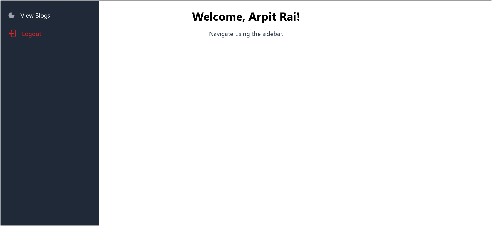
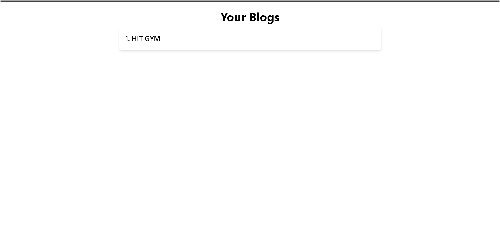
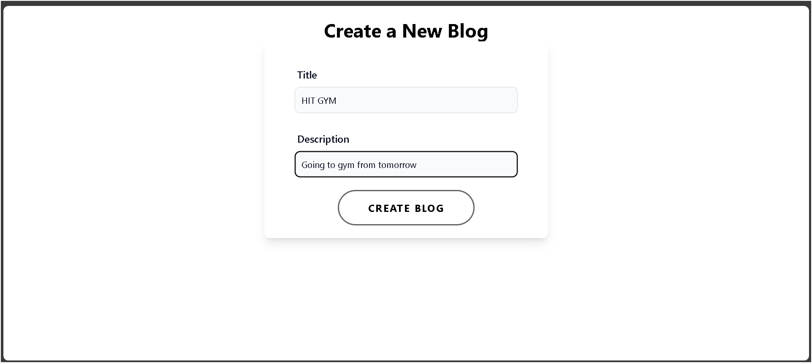
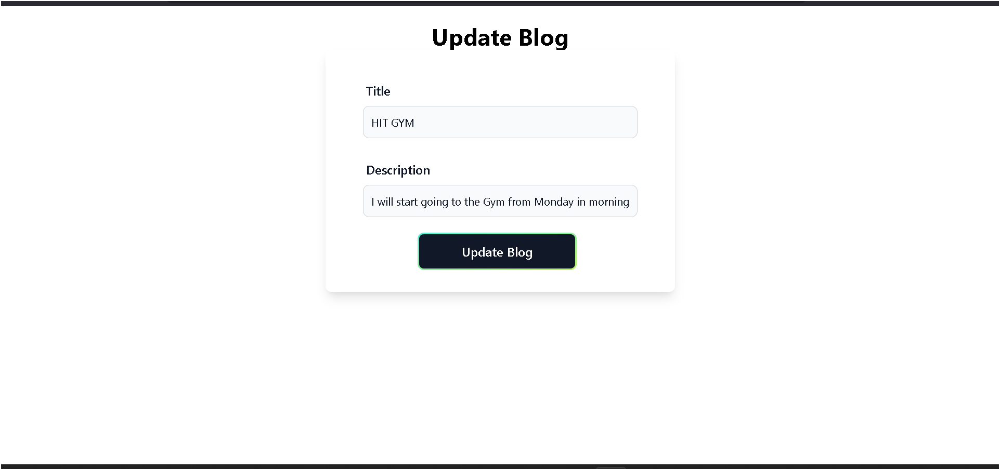
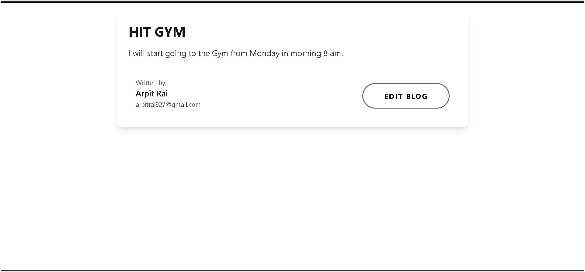

# 🚀 Blog Platform

A **full-stack** blog application built using **React**, **Hono**, **Cloudflare Workers**, and **Prisma Accelerate**. This project allows users to **sign up, create blogs, edit blogs, and view blogs** with authentication and real-time updates.

## 🌍 Live Demo

- **Frontend:** [W13 Blogs Project](https://w13-blogsproject.pages.dev/)
- **Backend:** [Blog API](https://blogbackendversion2.raiharshit66.workers.dev)

---

## 📸 Screenshots

### Home Page



### Blog List View



### Create Blog Page



### Edit Blog Page



### Individual Blog Page



---

## 📦 Tech Stack

### 🔹 **Frontend:**

- React + TypeScript
- React Router
- Axios for API requests
- TailwindCSS for styling

### 🔹 **Backend:**

- Hono (Cloudflare Workers framework)
- Prisma Accelerate (Edge database)
- JWT Authentication
- Zod for validation
- OpenAPI documentation with `@hono/zod-openapi`

### 🔹 **Deployment:**

- **Frontend:** Deployed on Cloudflare Pages
- **Backend:** Deployed on Cloudflare Workers

---

## 🛠️ Features

✅ User Authentication (Sign Up, Sign In, JWT-based Auth)\
✅ Blog CRUD operations (Create, Read, Update, Delete)\
✅ Secure API with validation and error handling\
✅ OpenAPI Spec with Swagger UI\
✅ Prisma Accelerate for optimized database queries

---

## 🎯 Installation & Setup

### 🔹 **1. Clone the Repository**

```sh
git clone https://github.com/kira14102005/W13_BlogsProject
cd W13_BlogProject
```

### 🔹 **2. Backend Setup**

```sh
cd backend
npm install
```

#### **Environment Variables (Backend)**

Create a `.env` file inside `backend/` and configure it based on `.env.example`:

```sh
DATABASE_URL=your_prisma_accelerate_url
JWT_KEY=your_secret_key
```

Additionally, ensure that `wrangler.toml` is properly configured. You can use `wrangler.toml.example` as a reference.

For additional database configuration inside `backend/db/`, refer to `.env.example` for required environment variables.

Run the backend locally:

```sh
npm run dev
```

### 🔹 **3. Frontend Setup**

```sh
cd frontend
npm install
```

#### **Environment Variables (Frontend)**

Create a `.env` file inside `frontend/` and configure it based on `.env.example`:

```sh
VITE_BACKEND_URL=your_backend_url
```

Run the frontend locally:

```sh
npm start
```

---

## 🚀 Deployment

### 🔹 **Deploying Backend on Cloudflare Workers**

```sh
cd backend
npx wrangler deploy
```

### 🔹 **Deploying Frontend on Cloudflare Pages**

```sh
cd frontend
npm run build
npx wrangler pages deploy ./build --project-name blog-frontend
```

---

## 📖 API Documentation

The backend provides an **OpenAPI specification** with a Swagger UI:

- [API Docs](https://blogbackendversion2.raiharshit66.workers.dev/swagger)

---

## 👥 Contributors

👤 **Harshit Rai**

---

## 📜 License

This project is licensed under the **MIT License**.

---

## ⭐ Show Your Support!

If you like this project, **give it a star ⭐ on GitHub!**

